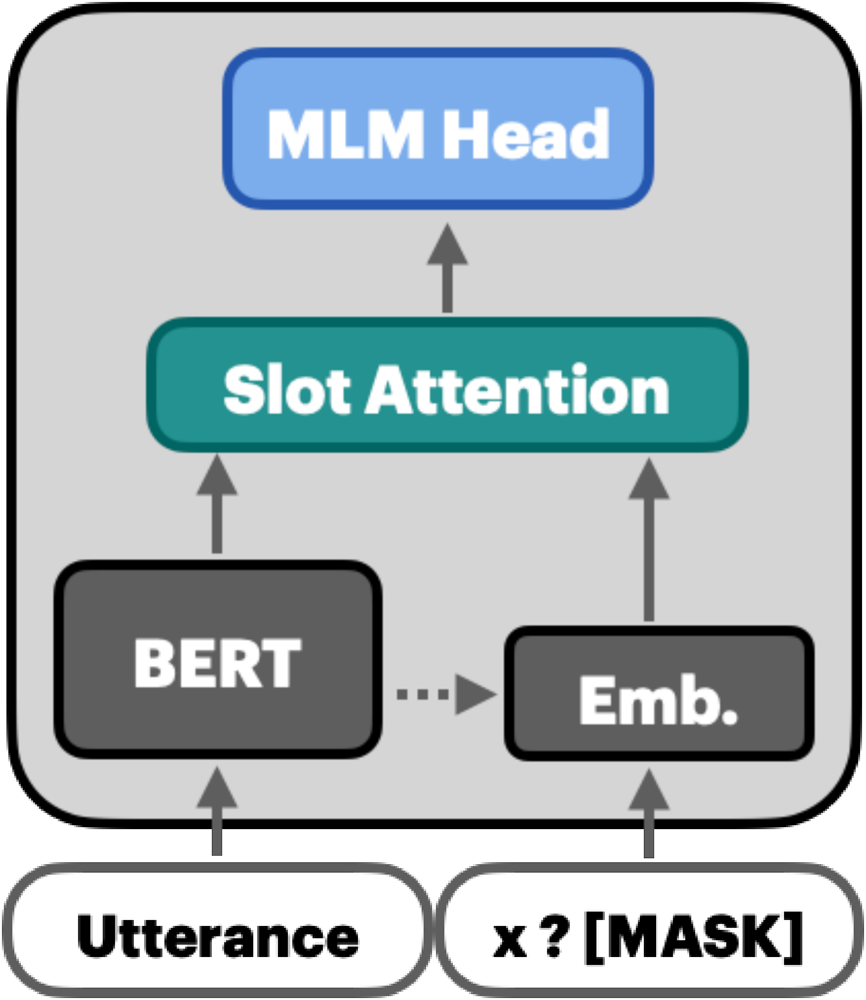
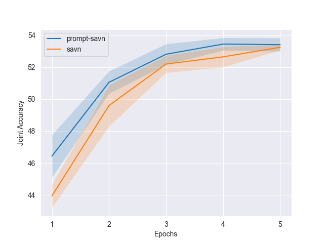
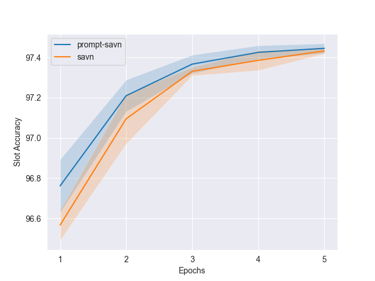
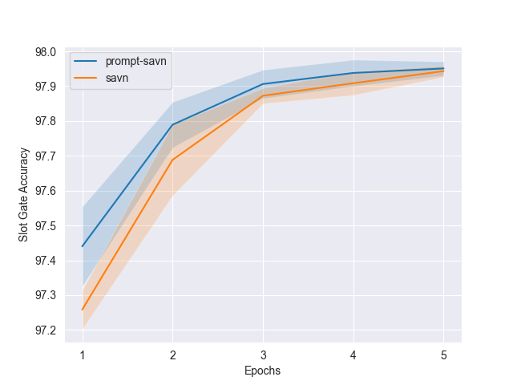
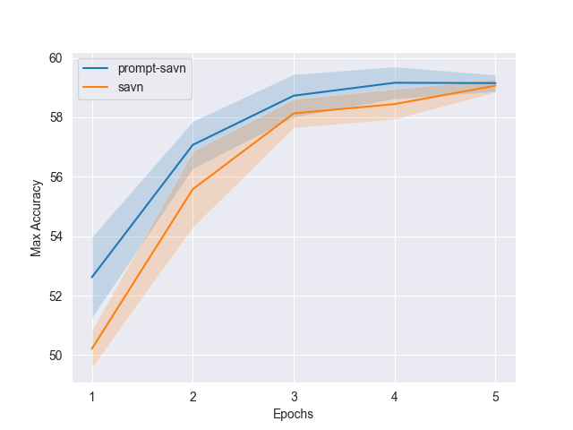
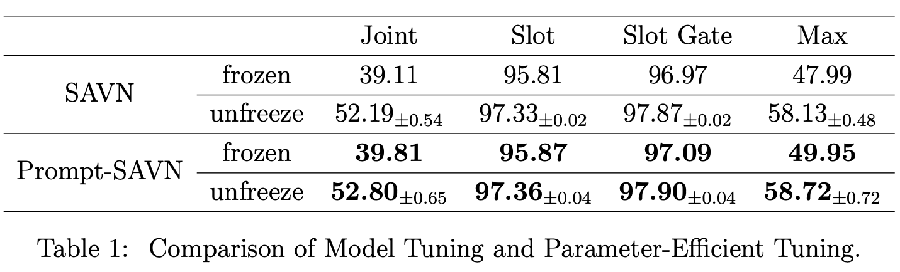

# Prompt-SAVN: Prompt-Tuning for Dialogue State Tracking

[**Data**](#dataset-and-preprocessing) | [**Play with Prompt-SAVN/SAVN Trainer**](#quick-tour) | [**Results**](#results)

The repository works on the implementation of **Prompt-SAVN** in Pytorch. We explore textual prompt for SAVN, called Prompt-SAVN, a simple yet effective technique for
better transfering language knowledge from the pre-trained language model (PLM)
to DST. Specifically, we re-frame gate classification as masked language modeling, We re-frame gate classification as masked language modeling, our prompt design is model agnostic which is plausible to any masked language model.


* New March 21st, 2021: Promt-SAVN

### Abstract

Pre-trained language models (PLMs), such as SAVN, have been widely used in dialogue stack tracking (DST) due to its strong performance. Despite the impressive performance, the potential capacity of such a Transformer-based model is less explored. In this paper, we firstly introduce a simple yet effective technique, Prompt-SAVN, which can be employed to any masked language models. We empirically study the performance of Prompt-SAVN and the original model SAVN in standard model fine-tuning by training the models with multiple random seeds. We showed that Prompt-SAVN outperforms SAVN by transferring its language knowledge to DST. We also found that models with multiple random seeds results in a large variance of joint accuracy. In addition, we further investigate the behavior of the models initialized from the frozen PLM. We found the significant gaps between fine-tuning and the parameter-efficient tuning where the weights of PLM are frozen. Finally, while recent works shown prompt-based tuning is effective in a limited-data setting, we found that both Prompt-SAVN and SAVN requires enough labeled data to be performant  model in DST. 


<p align="center">

</p>

<p align="center"> The overview of SAVN</p>


## References for the Implementations

Our code is built on the original implementation of [SAVN](https://github.com/wyxlzsq/savn). For quickly checking our implementation, we specify which file we contribute to our study.

In general, our script can be applied on:

1. Prompt-SAVN and SAVN on MultiWOZ 2.1 
2. Performing parameter-efficient tuning by freezing PLM's weights.
3. Training our models in a limited-data setting.


#### 1. Prompt-SAVN and SAVN

- `models/slot_attention.py`: `SlotAttentionNetwork` class for Prompt-SAVN and SAVN
- `trainer_slot_attention.py`: `SlotAttentionNetworkTrainer` for conducting training and evalaution
- `run_savn_trainer.py`: Runing `SlotAttentionNetworkTrainer` including dataset, tokenizer optmizer loading.


#### 2. Training Scripts

- `run_prompt-savn_trainer.sh`: Script for training Prompt-SAVN
- `run_savn_trainer.sh`:  Script for training SAVN
- `run_vn.sh`: Training the value normalization module

#### 3. Visualization

- `compute_scores.py`: export scores from log file in json format.
- `viz/acc_line.py`: Plot line chart of the averaging metrics.
- `viz/low_data_line.py`: Plotting line chart of the accuracy obtained from the models trained in low-data settings. 


## Installation

### Python version

* Python >= 3.8


Create an environment and install dependencies

```
pip install -r requirements.txt
```

## Dataset and Preprocessing

### MultiWOZ 2.1

We use MultiWOZ 2.1 throughout all the experiments where it is fully-labeled task oriented corpus covered 5 domains. We followed the open-source SAVN preprocessing procedure. We split the dataset into 8240, 1000 and 999 for train, development and test set respectively. 


```python
python create_data_2.1.py
```

### GPUs traning

We always set `--fp16` for multiple GPUs training for both Prompt-SAVN and SAVN. 
We train the models for 5 epochs using 4 RTX-2080Ti and evaluate the during training which is taking around $30$ mins. For parameter-efficient tuning where the pre-trained model is frozen, it takes around 50% of runtime. 

Don't forget to select CUDA device by specifing the id:

```python
export CUDA_VISIBLE_DEVICES=0,1,2,3
```

Note that the `vn_run.py` does not support multiple GPU training.

## Quick Tour

To investigate the training stability, we compare our Prompt-SAVN and SAVN without freezing the weights. We trained Prompt-SAVN and SAVN models for 5 epochs on MultiWOZ 2.1 with 5 random seeds {10, 15, 32, 42, 1074}. 

### Run Prompt-SAVN / SAVN trainer

Our `run_savn_trainer.py` sets up the dataset, model and the optimizer loading to initialize the trainer, one can use the example.
 
 
```python
python run_savn_trainer.py \
        --model_name_or_path "bert-base-uncased" \
        --tokenizer_name "model/bert-base-savn-vocab.txt" \
        --config_name "model/bert-base-uncased-config.json" \
        --dataset_version 2.1 \
        --train_file "data/${dataset_version}/train_dials.json" \
        --validation_file "data/${dataset_version}/dev_dials.json" \
        --predict_file "data/${dataset_version}/test_dials.json" \
        --use_sp \
        --use_vn \
        --output_dir tmp \
        --tensorboard_name runs/tmp \
        --utils_version "SA_2.1" \
        --do_train True \
        --do_eval True \
        --do_predict True \
        --num_train_epochs $num_train_epochs \
        --per_gpu_eval_batch_size 16 \
        --per_gpu_train_batch_size 8 \
        --eval_steps 0 \
        --save_steps 0 \
        --evaluate_during_training \
        --seed 1074 \
        --use_pattern \
        --max_train_samples -1 \
        --overwrite_output_dir \
        --fp16 \
    	2>&1 | tee ${output_dir}/sa_train.log
```

This example only runs Prompt-SAVN on random seed 42. To reproduce the result of using multiple random seeds. We suggest using the trainer script below. And note that the value normalization is required if the argument `--use_vn` is provided. The checkpoint and model architecture should be included in `output/vn_1_2.1_1`


### Training Prompt-SAVN / SAVN with script

To evaluate the architecture in different settings, such as the tuning strategy or training in a low-data setting. We use separate shell scripts to run various experiments on Prompt-SAVN and SAVN. 

Training Prompt-SAVN on 5 random seeds

```
. ./run_prompt-savn_trainer.sh
```

Training SAVN on 5 random seeds

```
. ./run_savn_trainer.sh
```

**Prompt-SAVN or SAVN.** Only one difference between two scripts is which model is used. When `use_pattern` is True, The model class `SlotAttentionNetwork` in `run_savn_trainer.py` will construct Prompt-SAVN including the textual prompt for slot, the Verbalizer and masked LM head as slot gate classificaiton layer. Otherwise `SlotAttentionNetwork` will use vanilla SAVN.

Note that `run_prompt-savn_trainer.sh` and `run_savn_trainer.sh` trains the models without freezing the pre-trained BERT and all training examples are fully used. To reproduce the result in low-data setting or parameter-efficient tuning. Please check the following paragraphs. 


**Low-data Training**. We conduct low-data settings by using the `max_train_samples` argument. By default (`-1`), all training examples are used. We experiment the models on the smaller dataset `{32,64,100,300,500,800,1000}`. You can reproduce by truncating the size of training examples using `max_train_samples`

**Model Tuning and Parameter-Efficient Tuning**. To study the performance using frozen PLM, we use the `--freeze_model` flag to determine whether to freeze pre-trained LM. You can choose whether to freeze PLM using `--freeze_model`


## Results

We show our result by running the scripts described above. For detailed information, please check the paper.

#### (I) Comparison of Prompt-SAVN and SAVN on 5 random seeds 

<p float="left">
  
   
</p>


<p float="left">
  
  
</p>


<p align="left">Comparison of Prompt-SAVN and SAVN on 5 random seeds: We trained Prompt-SAVN and SAVN for 5 epochs on MultiWOZ 2.1 with 5 random seeds {10, 15, 32, 42, 1074}. We report the Joint Accuracy (top left), Slot Accuracy (top right), Slot Gate Accuracy (bottom left) and Max Accuracy (bottom right). Prompt-SAVN outperforms SAVN over 5 epochs and shows its capacity of fast adaptation at first epoch by +2% absolute points. </p>


### (II) Model Tuning and Parameter-Efficient Tuning

<p align="center">

</p>


### Contact Information

For the help or the issues using the code, please submit a GitHub issue or contact the author via `pjlintw@gmail.com`.